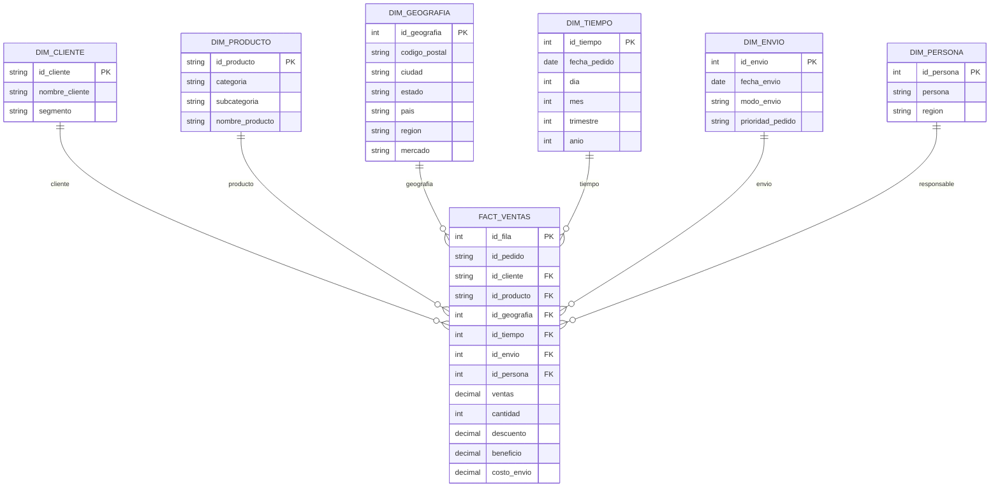

# Proyecto Final Diplomado Bases de Datos Relacionales y No Relacionales en un Entorno de Nube

## Resumen del Proyecto

| Campo | Descripción |
|---------|-------------|
| **Pregunta analítica** | ¿Qué productos, categorías y regiones generan la mayor rentabilidad y cuáles están reduciendo las ganancias debido a descuentos elevados y altos costos de envío? |
| **Dataset** | Global Superstore Orders 2016. Contiene información de pedidos, clientes, productos, ventas, descuentos, beneficios, costos de envío, mercados y regiones geográficas. |
| **Fuente** | https://www.kaggle.com/datasets/jaredrosas/global-superstore-orders-2016-es-esp |
| **Modelo** | Modelo dimensional tipo Star Schema con una tabla de hechos de ventas y dimensiones de Cliente, Producto, Tiempo y Geografía. |
| **Infraestructura** | PostgreSQL para almacenamiento y consultas, con Power BI para la construcción de dashboards e indicadores de negocio. |
| **ETL** | En proceso |
| **SQL avanzado** | En proceso |
| **Dashboard** | En proceso |

## 🎯 Objetivo de Negocio 

Se seleccionó el dataset **Global Superstore Orders 2016** debido a que representa un escenario empresarial realista donde se integran procesos de ventas, logística, clientes y productos. Este tipo de datos permite aplicar técnicas de Business Intelligence y análisis de datos para generar información valiosa para la toma de decisiones, identificando oportunidades de mejora en rentabilidad, segmentación de clientes y optimización de costos de envío.

La principal ventaja de este dataset es que contiene múltiples dimensiones de análisis (tiempo, geografía, clientes y productos), lo que permite construir modelos analíticos completos, consultas SQL avanzadas y dashboards ejecutivos similares a los utilizados en entornos empresariales reales.

Mediante análisis del dataset podemos reponder varias preguntas como lo pueden ser:
- ¿Qué productos generan la mayor rentabilidad?
- ¿Qué categorías tienen mayores ventas pero menores márgenes?
- ¿Cómo impactan los descuentos en el beneficio final?
- ¿Qué regiones presentan mejor desempeño comercial?
- ¿Qué modos de envío generan mayores costos logísticos?

## 📊 Descripción del Dataset inicial

| Campo | Descripción |
|--------|-------------|
| ID de fila | Identificador único del registro |
| ID de pedido | Identificador único de cada pedido |
| Fecha de pedido | Fecha en que se realizó la compra |
| Fecha de envío | Fecha en que se despachó el pedido |
| Modo de envío | Tipo de envío seleccionado por el cliente |
| ID de cliente | Identificador único del cliente |
| Nombre de cliente | Nombre del cliente |
| Segmento | Segmento comercial del cliente (Consumidor, Corporativo, etc.) |
| Código postal | Código postal de la ubicación del cliente |
| Ciudad | Ciudad donde se realizó la venta |
| Estado | Estado o provincia correspondiente |
| País | País donde se realizó la venta |
| Región | Región comercial asociada |
| Mercado | Mercado geográfico de operación |
| ID de producto | Identificador único del producto |
| Categoría | Categoría principal del producto |
| Subcategoría | Clasificación específica dentro de la categoría |
| Nombre de producto | Nombre comercial del producto |
| Ventas | Importe total de la venta |
| Cantidad | Número de unidades vendidas |
| Descuento | Descuento aplicado a la venta |
| Beneficio | Ganancia obtenida por la venta |
| Costo de envío | Costo asociado al transporte del pedido |
| Prioridad de pedido | Nivel de prioridad asignado al pedido |
| Persona | Persona encargada de la región |
 ---
 
## ⭐ Modelo Estrella

## 🧩 Diseño del Modelo Dimensional

Para este proyecto se implementó un modelo dimensional tipo **Esquema de Estrella** debido a que es uno de los enfoques más utilizados en entornos de Business Intelligence y Data Warehousing. Este modelo facilita el análisis de grandes volúmenes de datos mediante la separación de los indicadores de negocio y los atributos descriptivos.

La tabla central **Fact_Ventas** almacena las métricas cuantitativas que representan los eventos de negocio, como ventas, cantidad de productos vendidos, descuentos, beneficios y costos de envío. Estas métricas son las que posteriormente se analizarán mediante consultas SQL y visualizaciones.

Por otro lado, las tablas de dimensión contienen información descriptiva que permite segmentar y analizar los datos desde diferentes perspectivas:

- **Dim_Cliente:** permite analizar el comportamiento de compra por cliente y segmento.
- **Dim_Producto:** facilita el estudio de categorías, subcategorías y productos específicos.
- **Dim_Geografia:** permite evaluar el desempeño comercial por ciudad, estado, país, región y mercado.
- **Dim_Tiempo:** posibilita realizar análisis temporales, tendencias y comparaciones históricas.
- **Dim_Envio:** ayuda a evaluar la eficiencia logística y el impacto de los métodos de envío en la rentabilidad.
- **Dim_Persona:** permite analizar el desempeño comercial por responsable regional.

### 📋 Criterios de Diseño

La separación de las dimensiones se realizó siguiendo los siguientes criterios:

1. **Agrupación temática:** cada dimensión representa una entidad de negocio claramente identificable (cliente, producto, ubicación, tiempo, envío y responsable).
2. **Reducción de redundancia:** los atributos descriptivos se almacenan una sola vez y son reutilizados mediante claves foráneas.
3. **Facilidad de análisis:** el modelo permite responder preguntas de negocio desde múltiples perspectivas sin realizar consultas complejas sobre una única tabla transaccional.
4. **Escalabilidad:** facilita la incorporación futura de nuevas métricas o dimensiones sin afectar significativamente el modelo existente.
